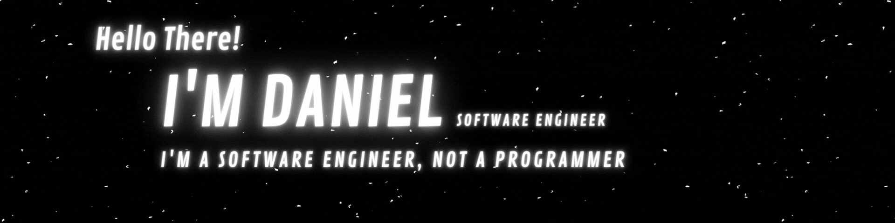

<h2>My name is Daniel Alejandro Morales Castillo, I'm a Software Engineer</h2>

<b>Microsoft Learn Student Ambassador - IBM zSystems Student Ambassador</b>

 
 

I am passionate about technology, programming and science.
I like to learn every day and I dream of being able to change the world. 🚀🌎

> "Remember to look up at the stars and not down at your feet" 🪐☄
>
> — Stephen Hawking

---

## GitHub Stats

